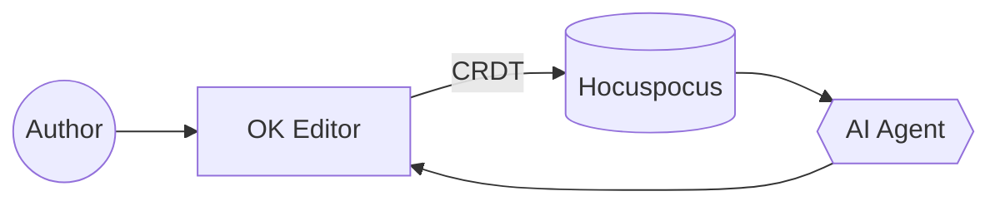

## Example

<ComponentPreview>
  <Mermaid chart={`graph LR
    Author((Author)) --> Editor[OK Editor]
    Editor -- CRDT --> Server[(Hocuspocus)]
    Server --> Agent{{AI Agent}}
    Agent --> Editor`} />
</ComponentPreview>

````text

````

## Props

_No public props._

_Also matches:_ `mermaid`, `diagram`, `flowchart`, `graph`, `sequence`, `sequencediagram`, `class`, `state`, `er`, `erdiagram`, `gantt`, `pie`, `chart`

## Author it

Type `/mermaid` in the editor to insert it from the slash menu, or write the tag directly in source mode. The Properties panel on the right of the editor exposes every prop above as a form field once the block is selected.
